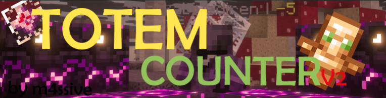

# TotemCounterV2

**Advanced totem pop counter for Crystal PVP with mouse-interactive HUD**

## 📖 Description

TotemCounterV2 is a feature-rich Minecraft mod designed specifically for Crystal PVP servers. It provides a beautiful, customizable HUD that tracks totem pops for all players, with full mouse interaction support for drag-and-drop positioning and resizing.

## ✨ Features

### 🎯 Core Functionality
- **Real-time Totem Tracking** - Automatically detects and counts totem pops for all players
- **Duplicate Event Prevention** - Smart filtering to prevent double-counting
- **Interactive HUD** - Fully mouse-interactive interface that can be dragged and resized

### 🎨 Customization
- **Visual Customization**
  - Customizable colors (text, background, border)
  - Adjustable scale and padding
  - Show/hide background and border
  - Totem icon display toggle
  - Custom display format

- **Display Options**
  - Show/hide self totem pops
  - Show only nearby players (configurable distance)
  - Maximum players to display
  - Auto-positioning (right-center by default)

### 🔊 Audio Features
- **Custom Sound Effects** - Multiple sound types available (Totem, Note Harp, Note Bell, Note Pling, Explode, Level Up, Orb Pickup, Item Pickup)
- **Volume & Pitch Control** - Fully adjustable audio settings (Volume: 0-100%, Pitch: 0.5-2.0)
- **Smart Sound Replacement** - Automatically disables Minecraft's default totem sound when custom sounds are enabled (prevents audio conflicts)

### ⚙️ User Experience
- **First-Time Setup** - Guided setup screen for new users with default settings
- **Edit Mode** - Press `K` to enter edit mode for easy HUD positioning
- **Config Menu** - Accessible via `H` or `L` key (dual keybind support)
- **Mod Menu Integration** - Full support for Mod Menu
- **Command Auto-complete** - TAB key support for `/resetcounter`, `/resetscoreboard`, and `/imperial` commands

### 📜 Commands
- `/resetcounter` - Reset totem counter
- `/resetscoreboard` - Reset scoreboard (both commands trigger the same reset function)
- `/imperial` - Our discord command (displays special message)

### 🎮 Keybinds
- **Config Menu** - `H` or `L` key (both keys work, default is `H`)
- **Edit Mode** - `K` key (allows dragging and resizing HUD)

## 📥 Installation

### Requirements
- **Minecraft**: 1.21.x
- **Fabric Loader**: 0.15.11 or higher
- **Fabric API**: Required
- **Java**: 21 or higher
- **Mod Menu** (Optional but recommended): For easier configuration

### Steps
1. Install [Fabric Loader](https://fabricmc.net/use/) for Minecraft 1.21
2. Download the latest version of [Fabric API](https://modrinth.com/mod/fabric-api)
3. Download TotemCounterV2 from [Modrinth](https://modrinth.com/mod/totemcounterv2) or [GitHub Releases](https://github.com/m4ssivee/totemcounterv2/releases)
4. Place both mods in your `.minecraft/mods` folder
5. Launch Minecraft and enjoy!

## 🚀 Usage

### First Launch
When you first launch the mod, you'll see a setup screen where you can:
- Choose your preferred config menu keybind (default is `H`, but `L` also works)
- Learn about the mod's features
- Default colors are set to Soft White text and Aqua border

### Positioning the HUD
1. Press `K` to enter Edit Mode
2. Drag the HUD to your desired position
3. Resize by dragging the corner handles
4. Press `K` again to exit Edit Mode

### Configuration
- Press `H` or `L` key to open the configuration menu
- Or access it through Mod Menu if installed
- Default colors: Soft White text and Aqua border
- Range and Max Player settings are located under Pitch slider in the config menu
- All settings are saved automatically

### Resetting Counters
Use either command to reset:
- `/resetcounter`
- `/resetscoreboard`

Both commands perform the same action (reset all totem counters).

## 📸 Screenshots

*Screenshots coming soon!*

## 🛠️ Technical Details

### Version
- **Current**: 2.1.0
- **Minecraft Support**: 1.21.x
- **License**: MIT

### Dependencies
- Fabric Loader (>=0.15.11)
- Fabric API (any version)

### Recommended
- Mod Menu (>=11.0.0)

## 🐛 Issues & Support

Found a bug or have a suggestion? 
- Report issues on [GitHub Issues](https://github.com/m4ssivee/totemcounterv2/issues)
- Join discussions on [GitHub Discussions](https://github.com/m4ssivee/totemcounterv2/discussions)

## 📝 Credits

- **Author**: m4ssivee
- **Repository**: [GitHub](https://github.com/m4ssivee/totemcounterv2)

## 📄 License

This project is licensed under the MIT License. See the LICENSE file for details.

---

Made with ❤️ for the Crystal PVP community

[Download on Modrinth](https://modrinth.com/mod/totemcounterv2) • [GitHub Repository](https://github.com/m4ssivee/totemcounterv2)

